# 旭峰新材料 ERP 员工操作手册

> 版本：v1.2（补充炼钢物品、成分、基础成本与计算核对全流程）  
> 编制日期：2026-07-16  
> 适用系统：旭峰新材料 ERP（当前 Web 版）  
> 适用角色：管理员、会计、审核员、只读

本手册依据当前代码权限、实际运行页面及一次完整的“会计提交 → 审核员审核”培训流程编制。截图来自本地 ERP 实机页面，红色编号与说明框对应每一步的操作重点。

## 目录

- [1. 手册说明](#1-手册说明)
  - [1.1 使用范围](#11-使用范围)
  - [1.2 培训数据与安全要求](#12-培训数据与安全要求)
  - [1.3 角色权限总览](#13-角色权限总览)
- [2. 通用操作](#2-通用操作)
  - [2.1 登录系统](#21-登录系统)
  - [2.2 页面布局](#22-页面布局)
  - [2.3 查询、查看、打印与列设置](#23-查询查看打印与列设置)
  - [2.4 订单状态与流转规则](#24-订单状态与流转规则)
  - [2.5 四类订单库存联动总表](#25-四类订单库存联动总表)
  - [2.6 撤销、驳回、反审核与库存回滚](#26-撤销驳回反审核与库存回滚)
  - [2.7 退出系统](#27-退出系统)
- [3. 会计操作手册](#3-会计操作手册)
  - [3.1 每日工作建议](#31-每日工作建议)
  - [3.2 工作台](#32-工作台)
  - [3.3 基础资料](#33-基础资料)
  - [3.4 采购管理](#34-采购管理)
  - [3.5 销售管理](#35-销售管理)
  - [3.6 炼钢记录](#36-炼钢记录)
    - [3.6.1 计算链路和岗位责任](#361-计算链路和岗位责任)
    - [3.6.2 第一步：创建可用于炼钢的物品](#362-第一步创建可用于炼钢的物品)
    - [3.6.3 第二步：新建炼钢记录并添加原料](#363-第二步新建炼钢记录并添加原料)
    - [3.6.4 第三步：保存草稿并自动计算](#364-第三步保存草稿并自动计算)
    - [3.6.5 第四步：打开详情逐项核对](#365-第四步打开详情逐项核对)
    - [3.6.6 第五步：确认记录](#366-第五步确认记录)
    - [3.6.7 常见问题和潜在风险](#367-常见问题和潜在风险)
  - [3.7 冶炼加工](#37-冶炼加工)
  - [3.8 外协加工](#38-外协加工)
  - [3.9 库房管理与库存变动](#39-库房管理与库存变动)
  - [3.10 用户对账](#310-用户对账)
  - [3.11 收付款记录](#311-收付款记录)
  - [3.12 开票记录](#312-开票记录)
  - [3.13 提交审核](#313-提交审核)
- [4. 审核员操作手册](#4-审核员操作手册)
  - [4.1 审核原则](#41-审核原则)
  - [4.2 查看待办](#42-查看待办)
  - [4.3 审核单笔或多笔订单](#43-审核单笔或多笔订单)
  - [4.4 通过与驳回](#44-通过与驳回)
  - [4.5 各模块审核重点](#45-各模块审核重点)
- [5. 只读角色操作手册](#5-只读角色操作手册)
  - [5.1 可执行操作](#51-可执行操作)
  - [5.2 查询业务数据](#52-查询业务数据)
  - [5.3 只读限制](#53-只读限制)
- [6. 管理员操作手册](#6-管理员操作手册)
  - [6.1 管理员职责](#61-管理员职责)
  - [6.2 用户管理](#62-用户管理)
  - [6.3 操作日志](#63-操作日志)
  - [6.4 审核、反审核与异常处理](#64-审核反审核与异常处理)
  - [6.5 系统设置现状](#65-系统设置现状)
- [7. 常见问题与处理](#7-常见问题与处理)
- [8. 附录](#8-附录)

## 1. 手册说明

### 1.1 使用范围

本手册用于员工培训、岗位交接和日常操作核对，覆盖以下模块：

- 工作台；
- 生产加工：炼钢记录、冶炼加工、外协加工；
- 购销管理：采购管理、销售管理；
- 仓库管理：库房管理、库存变动；
- 财务管理：用户对账、收付款记录、开票记录；
- 基础资料：往来单位、物品管理；
- 系统管理：审核中心、操作日志、用户管理。

### 1.2 培训数据与安全要求

1. 培训时使用带“手册演示”字样的账号或由管理员指定的测试账号。
2. 不要在正式数据中随意新建、删除、反审核或盘点调整。
3. 公用电脑不要勾选“记住密码”；离开座位前必须退出系统。
4. 驳回原因、库存调整原因、付款方式、发票号和备注必须可追溯，不得只写“有问题”“测试”等模糊内容。
5. 本手册截图中的批次和金额仅用于说明界面，不代表应照抄的业务数据。

### 1.3 角色权限总览

| 功能 | 管理员 | 会计 | 审核员 | 只读 |
|---|---:|---:|---:|---:|
| 查询所有业务数据 | ✓ | ✓ | ✓ | ✓ |
| 新建/编辑基础资料 | ✓ | ✓ | — | — |
| 新建/编辑购销、生产、库存、财务数据 | ✓ | ✓ | — | — |
| 提交订单审核 | ✓ | ✓ | — | — |
| 审核通过/驳回 | ✓ | — | ✓ | — |
| 反审核 | ✓ | — | — | — |
| 用户管理 | ✓ | — | — | — |
| 操作日志 | ✓ | — | — | — |

> 管理员拥有全部业务权限，但日常业务仍应由会计账号录入，管理员账号主要用于用户、日志、异常审核和权限管理。

## 2. 通用操作

### 2.1 登录系统

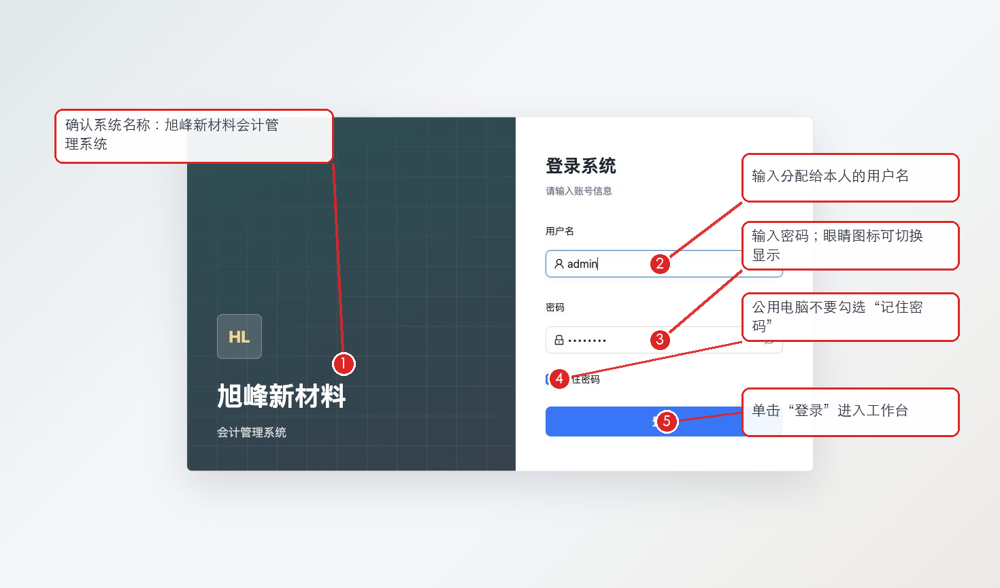

操作步骤：

1. 使用公司提供的 ERP 地址打开登录页。
2. 核对左侧系统名称，确认不是测试站或其他系统。
3. 输入管理员分配的用户名和密码。
4. 个人专用电脑可按公司规定决定是否勾选“记住密码”；公用电脑禁止勾选。
5. 单击“登录”。进入系统后，先核对页眉中的“当前用户”。

登录失败时：

- 提示“用户名或密码错误”：检查大小写、输入法和前后空格；
- 提示“用户已停用”：联系管理员恢复账号；
- 登录后立即跳回登录页：通常是登录状态失效，重新登录即可。

### 2.2 页面布局

ERP 页面由四部分组成：

- 左侧菜单：按业务域展开模块；
- 顶部栏：显示当前用户和退出按钮；
- 筛选条件：输入状态、单位、日期或关键词后单击“查询”；
- 业务表格：显示列表、选择框、打印、列设置和分页。

菜单内容随角色变化。管理员和审核员能看到“系统管理”；会计与只读角色看不到受限菜单。

### 2.3 查询、查看、打印与列设置

通用查询步骤：

1. 展开目标业务模块并进入列表页。
2. 在“筛选条件”中输入一项或多项条件。
3. 单击“查询”；若要清空全部条件，单击“重置”。
4. 双击一行业务记录查看详情。
5. 勾选记录后，可使用“打印所选”；详情弹窗中可使用“打印详情”。
6. 单击“列设置”调整显示列。列设置只影响查看，不改变业务数据。
7. 使用表格底部页码和“每页条数”浏览更多数据。

### 2.4 订单状态与流转规则

采购、销售、冶炼、外协订单采用统一状态思想：

| 状态 | 含义 | 主要可用操作 |
|---|---|---|
| 草稿 | 刚保存，尚未进入业务执行 | 编辑、开始、删除 |
| 进行中 | 已开始执行，可能已产生库存扣减 | 编辑允许字段、提交审核、撤销 |
| 待审核 | 会计已提交，等待审核员处理 | 审核员通过或驳回；会计停止修改 |
| 已审核 | 审核通过，等待完成 | 会计完成；管理员可反审核 |
| 已完成 | 业务闭环完成 | 查看；管理员在必要时反审核 |
| 驳回退回 | 审核不通过；当前实现通常回到“进行中”，并在备注保留 `[驳回]` 原因 | 会计查看原因、修改允许字段后重新提交；如需改已锁定出库行则先撤销回草稿 |

关键规则：

- 冶炼开始时会扣减投料和合金库存；外协开始时会扣减发出库存。
- 撤销或反审核可能回滚订单产生的库存联动，必须先确认是否已有后续业务。
- 炼钢记录使用“草稿 → 已确认”的独立流程，不进入审核中心。

### 2.5 四类订单库存联动总表

这是本手册最重要的库存规则。**提交审核和审核通过都不是库存动作**；真正的库存变化发生在“开始”或“完成”。

| 模块 | 保存草稿 | 单击“开始” | 提交审核 | 审核通过 | 单击“完成” |
|---|---|---|---|---|---|
| 采购 | 不动库存 | 不动库存 | 不动库存 | 不动库存 | 采购明细按入库日期、物品、规格、单位和归属入库 |
| 销售 | 不动库存，也不预占 | 不动库存，也不预占 | 不动库存 | 不动库存 | 从每行选定的库存记录扣减销售数量 |
| 冶炼 | 不动库存 | **投料和补加合金立即出库** | 不动库存 | 不动库存 | **出钢/产出明细入库** |
| 外协 | 不动库存 | **外协发出明细立即出库** | 不动库存 | 不动库存 | **回厂明细入库** |
| 炼钢记录 | 不动库存 | 不适用 | 不进入审核中心 | 不适用 | 不适用；“确认”也不动库存 |

必须牢记：

1. 冶炼、外协在“开始”时已经扣库，不能等到“完成”后才去核对发出库存。
2. 销售直到“完成”才扣库，进行中和已审核阶段都没有预留库存，存在被其他业务先用掉的风险。
3. 冶炼产出、外协回厂货物，只有订单审核通过后再执行“完成”，才会进入库房结存。
4. 采购货物也只有“完成”时入库；实物到了但订单未完成，ERP 可用库存仍不会增加。
5. 炼钢记录是成本、炉次和成分记录，不是仓库领料单。录入材料重量不会自动扣除原料库存。

### 2.6 撤销、驳回、反审核与库存回滚

| 操作 | 谁执行 | 状态结果 | 库存结果 |
|---|---|---|---|
| 撤销进行中/待审核订单 | 管理员或会计（以页面权限为准） | 回到草稿 | 回滚该订单已经写入的库存变动；冶炼投料、外协发出会加回 |
| 驳回待审核订单 | 审核员或管理员 | 回到进行中/可修改状态，并保留驳回原因 | **不新增库存动作**；冶炼/外协开始时的扣库仍然存在 |
| 反审核已审核/已完成订单 | 仅管理员 | 回到草稿 | 按库存日志反向回滚：原出库加回、原入库扣回 |

反审核不是普通改单方式。若完成后的产出、回厂货或采购货已经被销售、再次投料或再次外协，系统在反向扣回时可能因结存不足而失败，或者造成批次追溯断裂。管理员执行前必须查“库存变动”和下游订单，并取得业务负责人确认。

### 2.7 退出系统

完成操作后单击右上角“退出”。不要仅关闭浏览器标签页，尤其是在共享电脑上。

## 3. 会计操作手册

### 3.1 每日工作建议

建议按以下顺序工作：

1. 登录后查看工作台的采购、销售、库存、应收应付和待办数据。
2. 先维护新增的往来单位和物品。
3. 录入当天采购、销售、炼钢、冶炼或外协业务。
4. 核对库存变动是否与订单一致。
5. 导入或维护对账明细，再录入收付款和开票。
6. 对完整订单提交审核。
7. 下班前检查草稿、进行中、驳回和未对账记录。

### 3.2 工作台

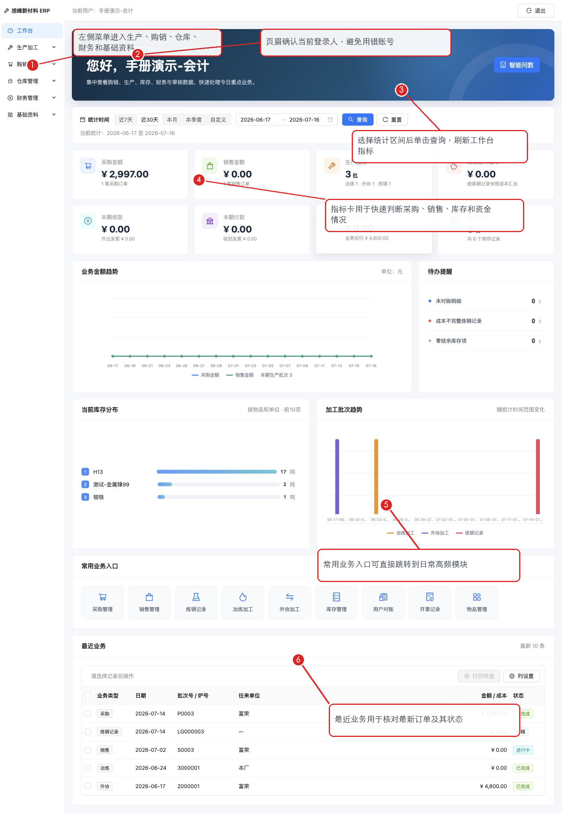

1. 在“统计时间”选择近 7 天、近 30 天、本月、本季度或自定义日期。
2. 单击“查询”刷新指标；“重置”恢复默认统计区间。
3. 核对采购金额、销售金额、生产批次、库存物品、本期收付款和应收应付。
4. 查看“待办提醒”，优先处理未对账、成本不完整或零结余异常。
5. 使用“常用业务入口”快速进入高频模块。
6. 在“最近业务”中核对最新批次及状态。

### 3.3 基础资料

#### 往来单位

路径：`基础资料 → 往来单位`

新建步骤：

1. 单击“+ 新建单位”。
2. 填写名称；简称、联系人、电话、地址和备注按实际情况填写。
3. 至少勾选一个角色：本厂、客户、供应商或加工商。同一单位可有多个角色。
4. 保存后，在列表中确认角色标签和名称正确。

注意：已被库存、对账、收付款或开票记录引用的单位不能直接删除，批量删除时系统会跳过。

#### 物品管理

路径：`基础资料 → 物品管理`

1. 单击“+ 新建物品”。
2. 填写物品名称并选择类型：钢种、原料、合金、成品、半成品或废料。
3. 需要成分管理时启用“化学成分”，填写 C、Mn、Si、Cr、W、Mo、V、Co、Nb、Ni、P、S；合计不得超过 100%。
4. 按需填写默认价格和备注，确认状态为“启用”。
5. 保存后通过名称或类型查询确认。

注意：有库存引用或被进行中订单引用的物品，删除时可能自动停用或被跳过。

### 3.4 采购管理

路径：`购销管理 → 采购管理`

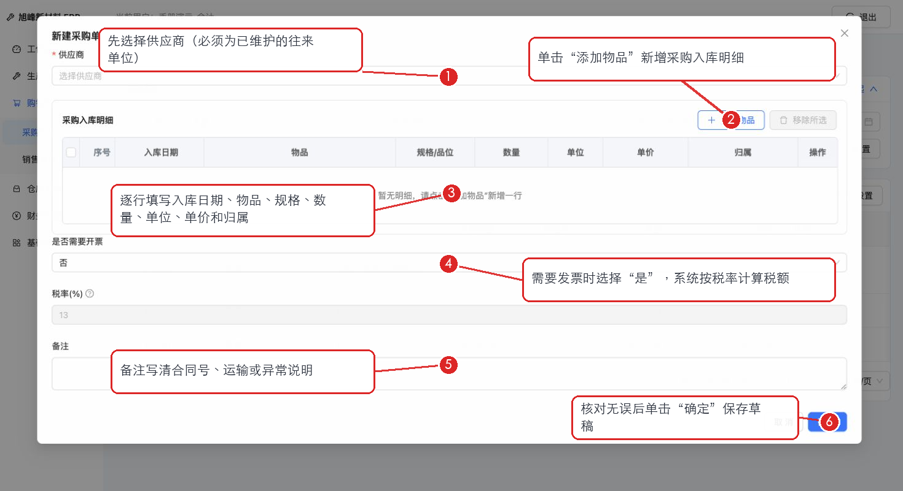

新建采购单：

1. 单击“+ 新建采购单”。
2. 选择供应商。
3. 单击“添加物品”，逐行填写入库日期、物品、规格/品位、数量、单位、单价和归属单位。
4. 多品种采购继续添加行；误加的行先勾选再“移除所选”。
5. 如需要发票，选择“是”并确认税率；不开发票时系统不计税。
6. 填写合同号、运输、验收或异常备注。
7. 单击“确定”保存，返回列表核对批次号、数量、金额和状态。
8. 按订单状态执行开始、提交审核、完成等后续动作。

### 3.5 销售管理

路径：`购销管理 → 销售管理`

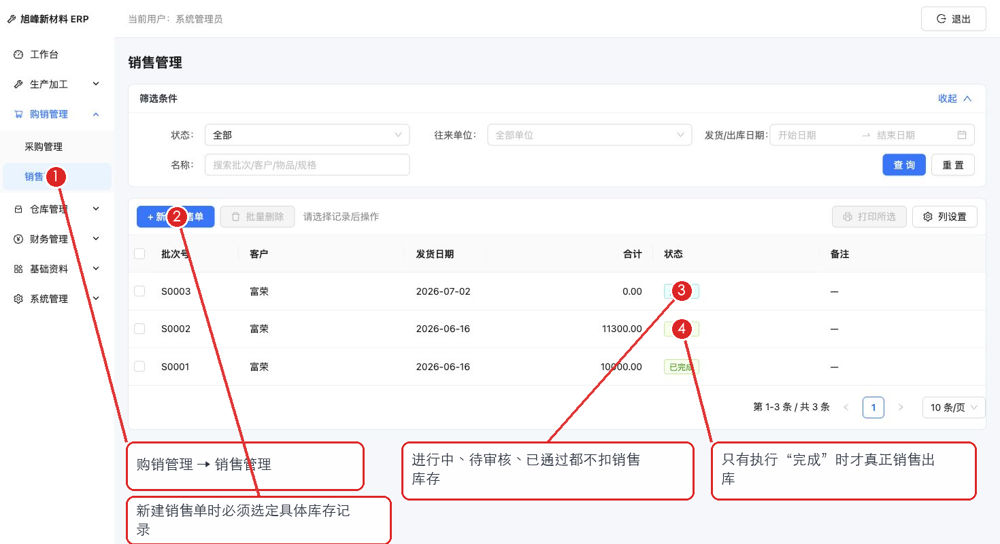

#### 3.5.1 新建和保存草稿

1. 单击“+ 新建销售单”，选择客户。
2. 添加销售明细。每行必须选择一条**具体库存记录**，不是只选择物品名称。该库存记录已经确定物品、规格、单位和货权归属。
3. 填写每行发货日期、数量、单价和备注；整单发货日期取明细中的最晚日期。
4. 需要发票时选择“是”并核对税率。税率影响金额和税额，不影响库存数量。
5. 保存为草稿，返回列表核对客户、发货日期、合计和状态。

草稿阶段不扣库存，也不预占库存，可以编辑或删除。

#### 3.5.2 草稿到完成的完整流程

1. **草稿 → 进行中**：会计勾选或打开销售单，单击“开始”。此时只改变状态，库存不减少。
2. **进行中 → 待审核**：会计再次核对库存记录、数量、价格、税率和发货日期，单击“提交审核”。库存仍不减少。
3. **待审核 → 已审核**：审核员在审核中心查看明细后单击“通过”。库存仍不减少。
4. **已审核 → 已完成**：会计回到销售列表，选择已审核订单并单击“完成”。系统此时才逐行从所选库存记录销售出库。
5. 完成后进入 `仓库管理 → 库存变动`，按批次号或备注核对“销售出库”；再到库房管理核对结存。

#### 3.5.3 销售库存扣减的精确规则

- 扣库时点：只有“完成”。开始、提交、审核通过都不扣库。
- 扣库来源：新建销售明细时选定的 `inventory_id` 对应库存行。
- 扣库日期：优先使用明细发货日期；没有时使用订单发货日期。
- 数量检查：完成时才检查所选库存行是否仍有足够结存。
- 撤销/反审核：管理员反审核已完成订单时，原销售出库数量会加回原库存。

#### 3.5.4 销售高风险问题

- **没有库存预占**：S0003 处于进行中并不代表库存已留给它。若另一张销售单、冶炼单或外协单先扣走同一库存，S0003 到“完成”时会报库存不足。
- **库存行选错**：同名物品可能因规格、单位或归属不同而有多条库存。选错会扣错货权或批次。
- **单位混用**：吨、千克等单位不会自动按员工想象换算。录入前统一合同、过磅单和库存单位。
- **先发货后补完成**：实物已经出库而 ERP 长时间停留在已审核，会造成账面库存虚高。公司应规定当天或班次内完成。
- **反审核后重复入账**：反审核会把销售数量加回；重新完成会再次扣减。处理中要核对库存变动，不能手工再加一次。

### 3.6 炼钢记录

路径：`生产加工 → 炼钢记录`

#### 3.6.1 计算链路和岗位责任

炼钢计算不是在新建炉次时临时手输一套原料参数，而是按以下链路工作：

`物品管理维护名称、成分和基础成本 → 炼钢记录选择物品并填写投入重量 → 保存草稿 → 系统生成物品快照 → 计算理论成分、材料成本、总成本和单吨成本 → 打开详情核对 → 确认`

关键规则：

1. 炼钢原料下拉框只显示“状态已启用”且“已启用化学成分”的物品。
2. 物品的化学成分是理论成分计算的来源；基础默认单价是原料成本计算的默认来源。
3. 炼钢保存时会保存物品名称、编号、成分、默认价和最终采用价的**快照**，保证以后能追溯当时使用的数据。
4. 会计或基础资料维护人员负责物品资料；炼钢录入人负责重量、炉重、现场时间和实际化验成分；确认人负责最终复核。
5. 炼钢仍然使用独立流程，不进入审核中心，也不联动库存。

#### 3.6.2 第一步：创建可用于炼钢的物品

路径：`基础资料 → 物品管理 → + 新建物品`

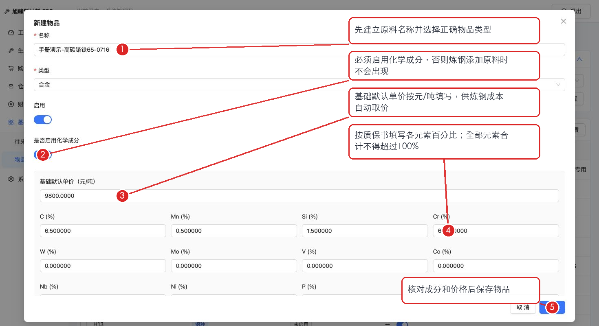

操作步骤：

1. 填写清晰且唯一的名称，例如“高碳铬铁65”。培训或测试物品应加“手册演示/测试”前缀。
2. 选择物品类型：原料或合金等。类型用于分类，不代替成分设置。
3. 保持“启用”为开启状态。
4. 开启“是否启用化学成分”。开启后才显示基础默认单价及 C、Mn、Si、Cr、W、Mo、V、Co、Nb、Ni、P、S 输入框。
5. 按采购质保书、化验单或公司认可的技术标准填写每个元素百分比。没有的元素填 0；系统要求全部已录元素合计不超过 100%。
6. 填写“基础默认单价（元/吨）”。无论炼钢投入用 kg 还是吨，此处价格单位始终是元/吨。
7. 在备注写明牌号、数据来源、价格日期或用途，然后单击“确定”。

> 元素合计不要求强行凑到 100%。系统只管理列出的 12 种元素，铁及其他未列元素不在此表中；不得把剩余比例随意加到某个元素。

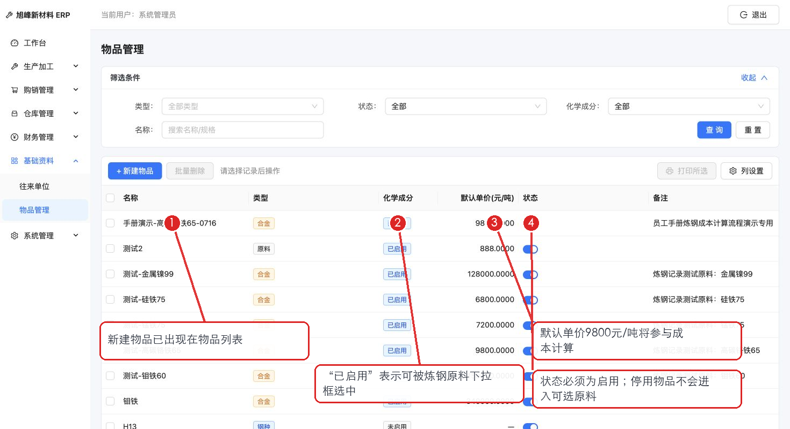

保存后必须在列表核对四项：名称正确、化学成分为“已启用”、默认单价正确、状态开关已启用。任一项不正确，都应先编辑物品，再开始录入炼钢记录。

#### 3.6.3 第二步：新建炼钢记录并添加原料

路径：`生产加工 → 炼钢记录 → + 新建炼钢记录`

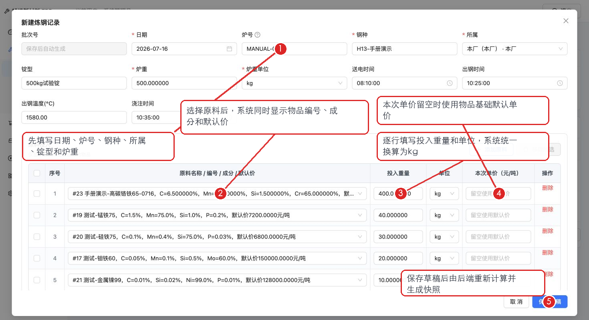

操作步骤：

1. 填写日期、炉号、钢种、所属、锭型、炉重和炉重单位。炉号留空时，保存后使用系统批次号。
2. 按现场记录填写送电时间、出钢时间、出钢温度和浇注时间。
3. 在“原料投入”区域单击“添加原料”。
4. 选择物品。选项会同时显示物品编号、主要成分和默认价；看不到目标物品时，返回物品管理检查“启用”和“化学成分”开关。
5. 填写实际投入重量并选择 kg 或吨。系统会统一换算为标准重量 kg。
6. “本次单价”通常留空，系统采用物品的基础默认单价；本炉确有经批准的特殊价格时填写本次单价，它将覆盖默认价。
7. 重复添加全部原料和合金，不能只填主要原料而漏掉高价小料。
8. 在“实际成品成分”填写本炉化验结果。没有化验值的元素留空，不要用 0 代替未知值。
9. 备注写明化验单号、配料单号或异常说明，单击“保存草稿”。

#### 3.6.4 第三步：保存草稿并自动计算

保存草稿后，系统重新读取所选物品，生成快照并计算。示例炉次 `LG000004 / MANUAL-0716` 使用 500 kg 炉重，计算结果如下：

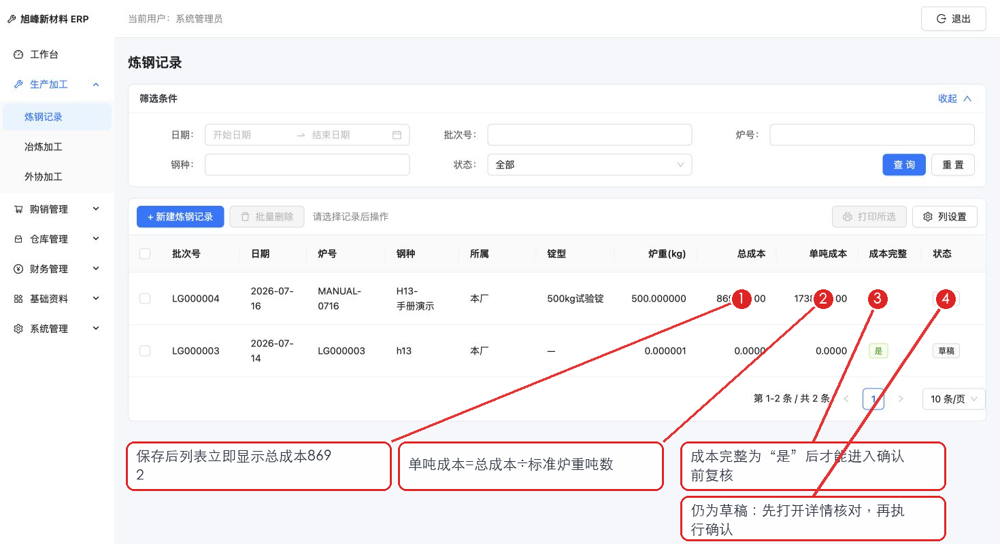

计算公式：

| 计算项 | 系统公式 |
|---|---|
| 标准重量 kg | kg 原样保留；吨 × 1000 |
| 最终采用价 | 本次单价不为空时采用本次单价，否则采用物品基础默认单价 |
| 单项材料成本 | 标准重量 kg ÷ 1000 × 最终采用价（元/吨） |
| 总成本 | 所有有价格原料的单项材料成本合计 |
| 单吨成本 | 总成本 ÷（标准炉重 kg ÷ 1000） |
| 某元素重量 kg | Σ（各原料标准重量 kg × 该物品元素百分比 ÷ 100） |
| 理论成分 % | 某元素重量 kg ÷ 标准炉重 kg × 100 |
| 偏差 % | 实际成分 % − 理论成分 % |

本手册示例成本复算：

| 原料 | 重量 | 采用价（元/吨） | 材料成本 |
|---|---:|---:|---:|
| 手册演示-高碳铬铁65-0716 | 400 kg | 9,800 | 3,920 |
| 测试-锰铁75 | 40 kg | 7,200 | 288 |
| 测试-硅铁75 | 30 kg | 6,800 | 204 |
| 测试-钼铁60 | 20 kg | 150,000 | 3,000 |
| 测试-金属镍99 | 10 kg | 128,000 | 1,280 |
| **合计** | **500 kg** | — | **8,692** |

标准炉重为 500 kg，即 0.5 吨，因此单吨成本为 `8,692 ÷ 0.5 = 17,384 元/吨`。

理论铬成分示例：铬铁投入 400 kg、物品 Cr=65%，铬元素重量为 `400 × 65% = 260 kg`；理论 Cr 为 `260 ÷ 500 × 100% = 52%`。

> 理论成分的分母是“标准炉重”，不是系统自动把所有投入原料重量重新归一化。录错炉重会同时扭曲理论成分和单吨成本。

#### 3.6.5 第四步：打开详情逐项核对

保存后不要直接确认。双击该炉次或单击“查看”，先核对成本快照。

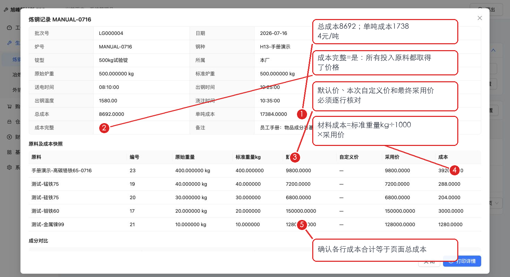

成本核对顺序：

1. 核对批次号、炉号、钢种、所属、炉重和生产时间。
2. 核对总成本、单吨成本和“成本完整”。
3. 在“原料及成本快照”中逐行核对原料名称、编号、原始重量、标准重量 kg、默认价、本次自定义价、采用价和材料成本。
4. 将各行材料成本手工相加，与页面总成本核对。
5. 若“本次自定义价”为“—”，采用价应等于默认价；若填写了本次价，采用价应等于本次价。

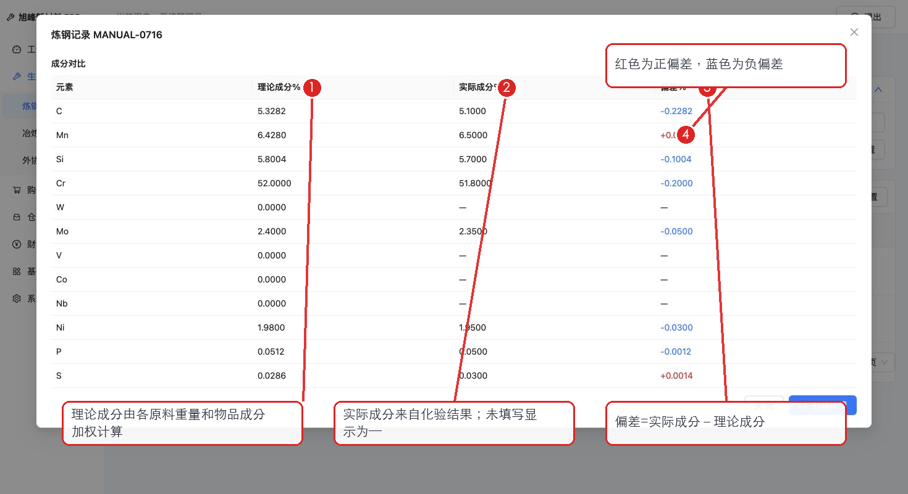

成分核对顺序：

1. 理论成分来自物品成分快照和投入重量，不是录入人手填。
2. 实际成分来自新建炼钢记录时填写的化验值；未填写显示“—”。
3. 偏差等于实际减理论。红色表示正偏差，蓝色表示负偏差；颜色只表示方向，不代表自动判定合格或不合格。
4. 按企业钢种标准判断偏差是否可接受。系统当前只计算和展示，不自动套用钢种上下限判定。
5. 需要留档时使用“打印详情”，把成本和成分明细随炉次资料保存。

#### 3.6.6 第五步：确认记录

炼钢记录采用独立状态链：

`新建草稿 → 保存并计算 → 打开详情核对 → 内部复核 → 确认`

- 草稿：管理员或会计可编辑、删除和确认。
- 已确认：记录锁定，用于成本、成分和炉次追溯；不进入审核中心。
- 确认前应由公司指定人员完成内部复核，因为审核员不会在审核中心看到炼钢记录。
- **保存和确认都不会扣减原料库存，也不会把钢锭加入库存。** 需要库存联动时另走冶炼或公司仓库流程，并用炉号/批次号相互关联。

#### 3.6.7 常见问题和潜在风险

| 问题或风险 | 原因与处理 |
|---|---|
| 添加原料时找不到物品 | 物品被停用或未启用化学成分；先回物品管理修正。 |
| 成本完整显示“否” | 至少一行既没有本次单价，也没有物品默认价；补价格后重新保存。 |
| 成本完整显示“是”，但总成本为 0 | 当前实现中“没有任何原料行”也可能显示成本完整。必须同时检查原料明细至少有一行、重量真实、价格非零，不能只看“是”。 |
| 本次单价误填为 0 | 0 是有效自定义价格，会覆盖默认价并使该行成本为 0；不确定时应留空，而不是填 0。 |
| 理论成分整体偏高或偏低 | 优先检查炉重、炉重单位、投入重量单位和是否漏料；理论成分使用炉重作分母。 |
| 单吨成本异常放大或缩小 | 常见于 500 kg 误填成 500 吨、价格单位不是元/吨，或高价合金重量录错。 |
| 修改物品价格后旧炉次没有变化 | 已保存炉次保留当时快照，这是正常追溯设计。旧记录不会自动跟随基础资料变化；草稿重新编辑并保存时会重新取当前物品资料。 |
| 实际成分空白被填成 0 | 0 表示实际检测为零，空白表示没有数据，两者含义不同；无化验结果时留空。 |
| 物品成分合计超过 100% | 检查百分比单位、重复元素和小数点；不得为了保存随意降低真实值。 |
| 确认后发现物品或炉重错误 | 先停止使用该炉次数据，联系管理员按公司纠错流程处理；不要另建重复炉次掩盖错误。 |
| 炼钢确认后库存没有变化 | 这是当前设计。炼钢是成本和成分记录，不是库存单据。 |
| 同一批材料又在冶炼单扣库 | 炼钢记录本身不扣库；冶炼单用于真实库存联动。两边用同一炉号关联，但成本口径必须由财务复核，防止重复核算。 |

### 3.7 冶炼加工

路径：`生产加工 → 冶炼加工`

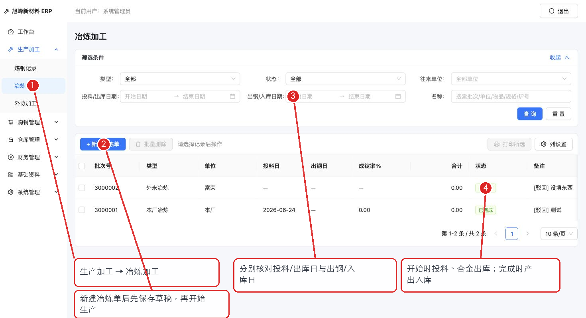

#### 3.7.1 新建和保存草稿

1. 单击“+ 新建冶炼单”，选择业务单位和类型（外来冶炼或本厂冶炼）。
2. 添加投料明细。每行从库存中选择实际投料来源，填写投料/出库日期、物品、规格、数量、单位和归属。
3. 添加出钢/产出明细，填写出钢/入库日期、钢种或物品、规格、数量、单位、炉号和归属。
4. 需要补加合金时添加合金明细，并为每行选择实际库存来源。
5. 填写加工单价、税率、开票需求和备注，核对合计。
6. 保存为草稿。草稿不动库存，可继续修改全部明细。

#### 3.7.2 草稿到完成的完整流程

1. **草稿 → 进行中（关键扣库点）**：会计确认投料和合金实际领用后单击“开始”。系统立即从各明细选定的库存行扣除投料及合金数量，并写入库存变动。开始后投料、合金明细锁定。
2. **进行中补产出**：按实际出钢和过磅结果补齐或复核产出物品、规格、数量、单位、炉号、日期和归属。此时产出尚未入库。
3. **进行中 → 待审核**：确认投料、产出、成锭率、价格、税率、备注完整后单击“提交审核”。提交不再次扣库，也不入库。
4. **待审核 → 已审核**：审核员核对投入、产出、成锭率、归属和库存记录后通过。审核通过仍不入库。
5. **已审核 → 已完成（关键入库点）**：会计选择订单并单击“完成”。系统将有效出钢/产出明细按各行日期、物品、规格、单位和归属加入库存。
6. 完成后在“库存变动”中同时核对“冶炼投料/合金出库”和“冶炼产出入库”。

#### 3.7.3 成锭率和库存规则

- 成锭率按有效产出数量 ÷ 投料数量计算。
- 产出中的原料或废料类返回物不计入有效产出和加工金额，但仍应按实际业务正确记录。
- 有效产出不能超过投料数量；出现超过时先查单位、过磅、重复行和物品类型，不要为通过校验而修改真实数据。
- 外来冶炼尤其要核对货权归属。产出行未选正确客户，可能进入本厂或错误单位的库存。

#### 3.7.4 冶炼高风险问题

- **过早单击开始**：一旦开始，投料和合金已经出库且相关行锁定。选错库存、规格、归属或数量只能撤销回草稿后重做。
- **只填投料，不填产出就完成**：会造成材料已扣而成品未正确入库。审核员必须检查产出明细不是空白占位。
- **产出归属错误**：同一物品会按归属分别形成库存；客户料误入本厂会直接造成货权错误。
- **规格或单位不一致**：完成时可能新建另一条库存行，看起来像“货没进原库存”。应按物品、规格、单位、归属四项查询。
- **日期回填错误**：库存日志会使用明细日期，跨月回填会改变历史期间的库存追溯口径。
- **撤销后的重复出库**：撤销会将已扣投料加回；修改后再次开始会重新扣库。必须以库存变动日志为准，不能手工补扣。

### 3.8 外协加工

路径：`生产加工 → 外协加工`

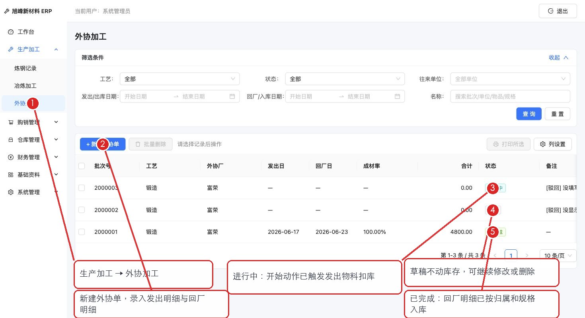

截图中同时展示了草稿、进行中和已完成三种状态。进行中订单表示已经执行过“开始”，其发出库存通常已扣减；不能仅凭发出日期为空就认为未扣库，应以库存变动日志为准。

#### 3.8.1 新建和保存草稿

1. 单击“+ 新建外协单”，选择外协厂和工艺（锻造、电渣、车加工或退火）。
2. 添加发出明细，从库存中选择实际发出的库存行，填写发出日期、物品、规格、数量、单位和归属。
3. 已知回厂计划时可先录回厂明细；实际回厂后必须按过磅/验收结果修正回厂日期、物品、规格、数量、单位和归属。
4. 填写加工单价、税率、开票需求、合同或送货单号及备注。
5. 保存为草稿。草稿不动库存，可编辑或删除。

#### 3.8.2 草稿到完成的完整流程

1. **草稿 → 进行中（关键扣库点）**：实物发出并确认库存来源后单击“开始”。系统立即扣减所有外协发出明细，并锁定发出明细。
2. **进行中等待回厂**：跟踪外协厂、工艺进度和在外数量。实际货物回厂后，按验收单补齐回厂明细。此时回厂货物仍未进入 ERP 库存。
3. **进行中 → 待审核**：发出和回厂明细、加工费用、税率、成材率及异常损耗均核对后提交审核。提交不入库。
4. **待审核 → 已审核**：审核员核对货权、发出量、回厂量、成材率、日期和费用后通过。审核通过仍不入库。
5. **已审核 → 已完成（关键入库点）**：会计确认实物已验收，再单击“完成”。系统将回厂明细按其日期、物品、规格、单位和归属加入库存。
6. 完成后在“库存变动”中核对一组相互关联的“外协发出出库”和“外协回厂入库”。

#### 3.8.3 回厂货物何时增加库存

回厂日期只是业务日期字段，**填写回厂日期、提交审核、审核通过都不会增加库存**。只有订单已经通过审核并执行“完成”，回厂明细才真正入库。若实物已经回厂但订单未完成，库房人员在 ERP 中看不到这部分可用结存。

入库后的库存归属取回厂明细的归属；未按实际货权选择会造成客户料与本厂料混淆。规格或单位不同也可能形成新的库存行，而不会并入原发出库存行。

#### 3.8.4 外协高风险问题

- **开始早于实物发出**：账面库存已经减少，实物仍在厂内，形成账实差异。
- **实物发出后忘记开始**：账面库存虚高，可能又被其他销售/生产订单选中。
- **回厂就认为已入库**：未执行完成前，ERP 不增加库存。仓库若直接领用，会出现系统无库存。
- **部分回厂就完成**：系统允许有效回厂量不超过发出量。若尚有在外余量，过早完成会关闭该批次，后续回厂难以在原单继续处理。完成前必须由业务人员确认“本批是否已全部结案”。
- **损耗没有说明**：回厂量小于发出量时，应在备注写明正常损耗、废料、留存或待返数量，并让审核员核对成材率。
- **归属为空或错误**：系统可能按内部单位等默认逻辑入库，造成货权错误；不要依赖默认值。
- **撤销/反审核与下游冲突**：回厂货已被销售或再次加工后再反审核，回滚入库可能因结存不足失败。

### 3.9 库房管理与库存变动

路径：`仓库管理 → 库房管理`

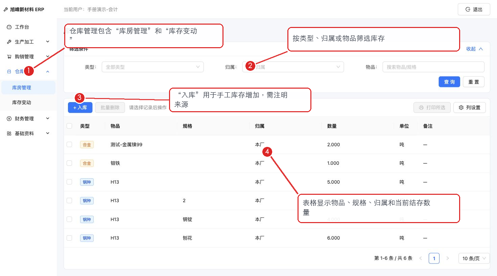

手工入库：

1. 单击“+ 入库”。
2. 选择物品和归属单位，填写规格、单位、数量、变动日期和备注。
3. 单击“确认入库”，然后在列表和“库存变动”中核对。

出库：在目标库存行选择“出库”，填写出库数量、日期和备注；数量不能超过当前库存。

盘点调整：在目标库存行选择“盘点调整”，填写实际数量、日期和差异原因。盘点调整会生成库存变动记录，不得用来代替正常采购、销售或加工流程。

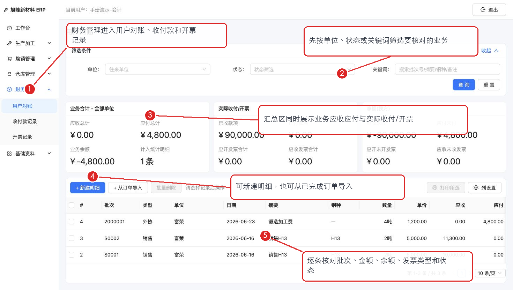

### 3.10 用户对账

路径：`财务管理 → 用户对账`

1. 先按单位、状态或关键词查询。
2. 核对应收总计、应付总计、业务余额、已收已付、应开/应收发票和净额。
3. 推荐使用“+ 从订单导入”，选择已完成的采购、销售、冶炼或外协订单，预览后再导入。
4. 特殊业务可用“+ 新建明细”，填写往来单位、日期、摘要、物品、数量、单位、单价、应收、应付、发票类型、发票金额和备注。
5. 检查同一订单是否已导入，避免重复对账。

### 3.11 收付款记录

路径：`财务管理 → 收付款记录`

1. 单击“+ 新建收付款”。
2. 选择往来单位。
3. 按往来单位视角选择方向：“往来单位付款”或“往来单位收款”。
4. 填写日期、金额和方式。
5. 优先从用户对账记录选择关联订单；确有需要时再手动填写订单类型和订单 ID。
6. 填写银行流水号或必要备注，保存后核对汇总金额。

### 3.12 开票记录

路径：`财务管理 → 开票记录`

1. 单击“+ 新建开票”。
2. 选择往来单位和方向，填写日期、金额及发票号。
3. 优先从用户对账记录关联订单。
4. 核对发票方向是否与业务一致，保存后检查开出与收到发票汇总。

### 3.13 提交审核

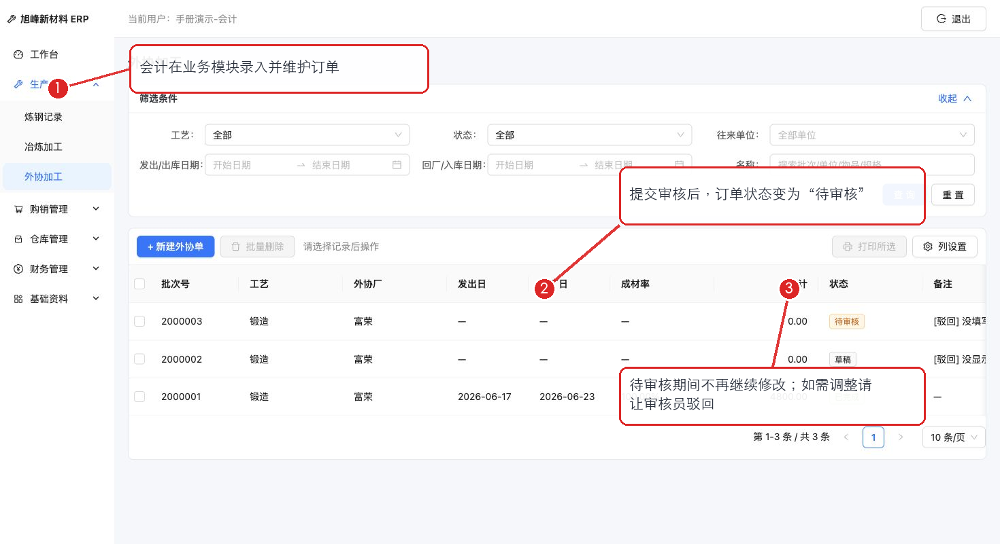

#### 3.13.1 一张普通订单必须走完的状态链

采购、销售、冶炼和外协必须按以下顺序闭环：

`草稿 → 开始 → 进行中 → 提交审核 → 待审核 → 审核员通过 → 已审核 → 会计完成 → 已完成`

| 当前状态 | 经办人要做什么 | 下一动作 | 是否可随意改明细 | 库存提示 |
|---|---|---|---|---|
| 草稿 | 补齐业务和明细，进行第一次自检 | 开始 | 可以 | 全部模块都不动库存 |
| 进行中 | 核对实际执行结果和金额 | 提交审核 | 销售/采购可改；冶炼投料合金、外协发出已锁定 | 冶炼投料/合金、外协发出已经扣库；销售/采购未动库存 |
| 待审核 | 等审核员处理，不再改单 | 通过或驳回 | 不可以 | 提交动作本身不动库存 |
| 已审核 | 确认实物与凭证均已满足结案条件 | 完成 | 不可以 | 审核通过本身不动库存 |
| 已完成 | 核对库存变动和后续对账 | 无普通下一步 | 不可以 | 采购、冶炼产出、外协回厂已入库；销售已出库 |

驳回不是完成。审核员驳回后，订单回到进行中/可修改状态，列表备注会保留 `[驳回] 原因`。会计必须按原因修改，再重新提交；不能新建一张重复订单来绕开驳回。

#### 3.13.2 提交前检查清单

- 往来单位、日期、物品、数量、单位、单价和归属完整；
- 投料/发出/销售明细选择的是正确库存行，规格、单位和货权归属一致；
- 冶炼、外协已经在库存变动中看到开始时产生的出库记录；
- 产出或回厂实物、日期、数量和验收结果已经确认；
- 合计、税率和开票需求正确；
- 备注能够说明异常和业务依据；
- 订单没有重复录入。

#### 3.13.3 提交、审核和完成的职责边界

- 会计提交：表示资料已经自检完毕，可以交审核；不等于库存已完成。
- 审核员通过：表示业务数据和依据通过复核；不代替会计确认实物是否已达到结案条件。
- 会计完成：执行最终库存联动并关闭订单。点击前必须再次核对库存和实物。
- 管理员反审核：只用于纠错，不属于日常流程。

提交后订单变为“待审核”，会计停止修改并等待审核员。若被驳回，先阅读驳回原因，修正后重新提交。审核通过后，会计必须回到原业务列表执行“完成”；只停留在“已审核”会导致采购/产出/回厂未入库，或销售未出库。

#### 3.13.4 完成后的强制核对

1. 进入 `仓库管理 → 库存变动`，按批次号、物品或日期查询。
2. 核对变动方向、数量、日期、物品、规格、单位和归属。
3. 回到 `仓库管理 → 库房管理`，核对当前结存。
4. 采购/销售/冶炼/外协需要财务结算时，再从已完成订单导入用户对账。
5. 发现错误先停止下游使用，保留截图和单据号，通知管理员评估撤销或反审核；不要用手工盘点调整掩盖订单错误。

## 4. 审核员操作手册

### 4.1 审核原则

- 先看明细，后点通过；
- 对单位、日期、数量、单价、税率、归属、库存联动和备注逐项核对；
- 不能确定时驳回并写清原因，不要代替录入人修改；
- 严禁“先通过、后补资料”。

### 4.2 查看待办

登录后可在工作台查看“待审核订单”，也可进入 `系统管理 → 审核中心`。按类型筛选冶炼、外协、采购或销售订单。

### 4.3 审核单笔或多笔订单

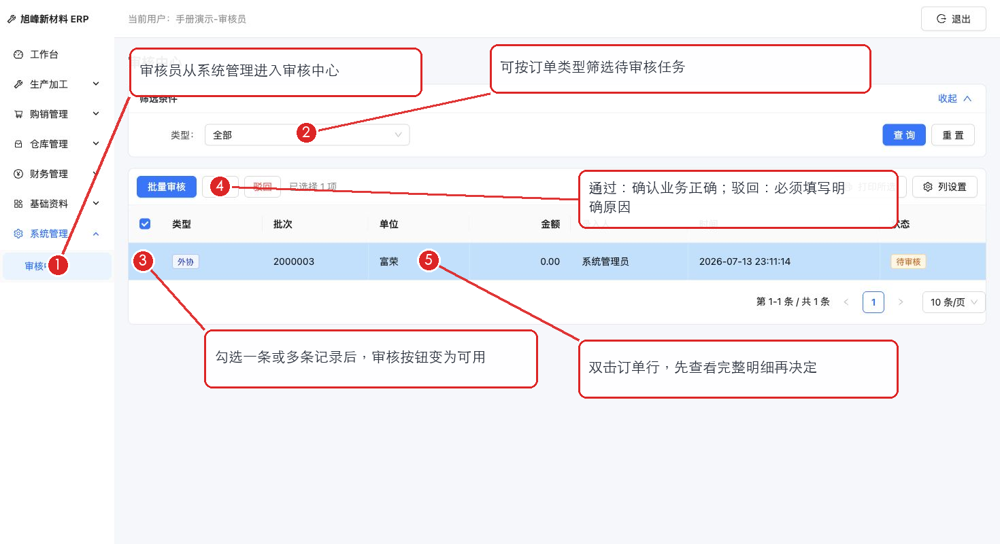

1. 选择订单类型并单击“查询”。
2. 双击订单行查看完整详情。
3. 单笔审核：核对后选择该行，再单击“通过”或“驳回”。
4. 批量审核：只勾选业务性质相同且已逐条核对的记录，再单击“批量审核”。
5. 打印或留档时，使用“打印所选”或详情中的“打印详情”。

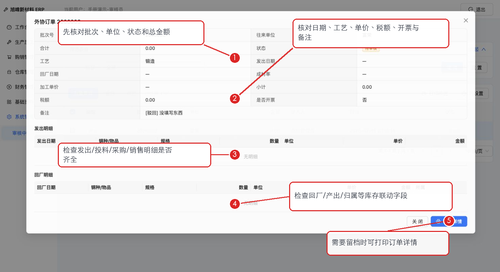

详情核对重点：

- 基本信息：批次、单位、金额、状态；
- 业务信息：日期、工艺/类型、数量、单位、单价；
- 财税信息：税率、税额、是否开票；
- 库存信息：发出、投料、合金、回厂、产出和归属；
- 异常说明：备注是否与数据一致。

### 4.4 通过与驳回

通过：确认数据正确、附件/业务依据完整且库存联动合理后使用。通过只把订单推进到“已审核”，**不会执行采购入库、销售出库、冶炼产出入库或外协回厂入库**。后续仍需会计在业务列表执行“完成”。

驳回：必须写清“哪个字段、正确值或补充材料、为什么”。例如：

> 回厂明细缺少归属单位，请按实际货权补充后重新提交。

不要只写“有问题”“重做”。驳回后订单退回会计处理，审核员在再次提交后重新核对。冶炼和外协已经开始产生的出库不会因为“驳回”自动加回；只有会计/管理员执行撤销回草稿时才回滚。

### 4.5 各模块审核重点

| 模块 | 审核员必须核对 | 通过后提醒 |
|---|---|---|
| 采购 | 供应商、入库日期、物品、规格、单位、数量、单价、税率、归属 | 会计完成后才采购入库 |
| 销售 | 客户、具体库存来源、发货日期、数量、单价、税率、库存是否可能不足 | 会计完成时才扣库；通过不代表库存已预留 |
| 冶炼 | 投料和合金出库日志、产出、炉号、成锭率、归属、加工费 | 开始时已扣投料；完成才入产出 |
| 外协 | 发出日志、外协厂、工艺、回厂量、成材率、损耗说明、归属 | 开始时已扣发出；完成才入回厂 |

审核员发现以下情况应驳回：销售库存行与合同规格不符；冶炼有效产出大于投料；外协部分回厂却没有在外余量说明；客户料被填成本厂归属；数量单位疑似吨/千克混用；订单显示进行中但找不到应有的投料或发出库存变动。

## 5. 只读角色操作手册

### 5.1 可执行操作

只读角色可：

- 查看工作台指标；
- 查询生产、购销、库存、财务和基础资料；
- 双击查看详情；
- 打印所选或打印详情；
- 调整表格显示列和分页。

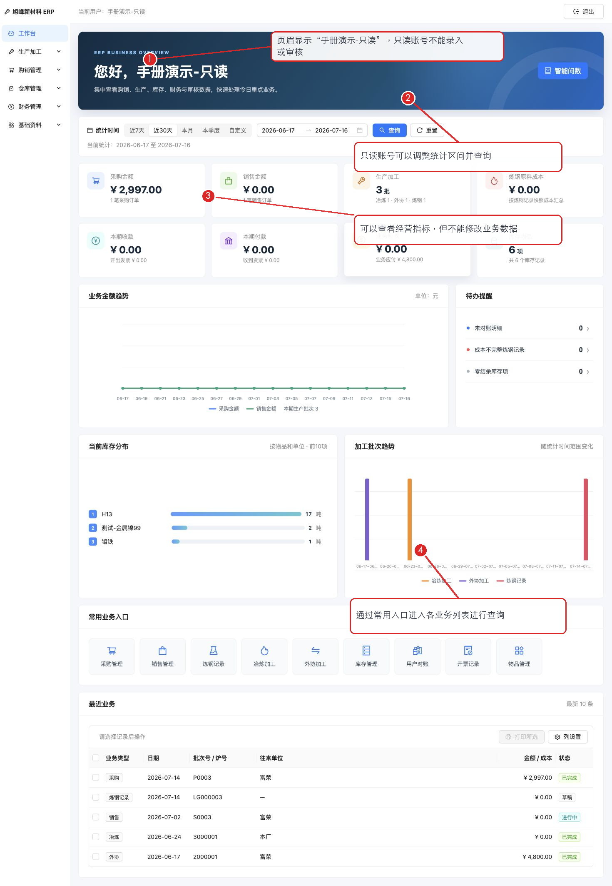

### 5.2 查询业务数据

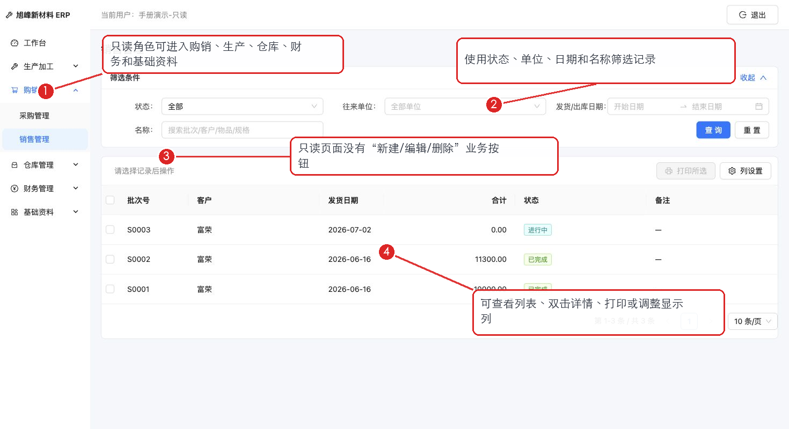

1. 从左侧菜单进入目标模块。
2. 设置状态、往来单位、日期和关键词等筛选条件。
3. 单击“查询”。
4. 双击目标记录查看详情。
5. 如需留档，勾选记录后打印。

### 5.3 只读限制

只读角色没有新建、编辑、删除、库存调整、提交审核、通过、驳回或用户管理权限。若岗位需要录入或审核，应由管理员调整角色，禁止借用他人账号。

## 6. 管理员操作手册

### 6.1 管理员职责

管理员负责：

- 创建、编辑、停用和删除用户；
- 分配正确角色并重置密码；
- 查看操作日志和追溯异常；
- 在必要时参与审核；
- 谨慎执行反审核；
- 同时具备会计的业务录入权限，但不建议用于常规录入。

### 6.2 用户管理

路径：`系统管理 → 用户管理`

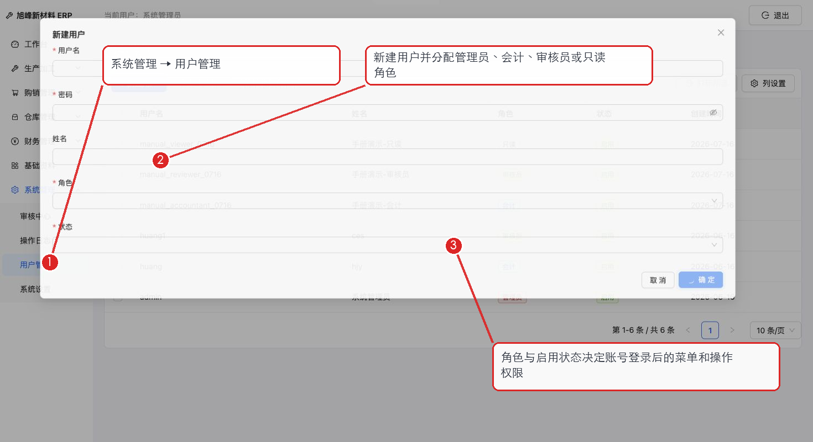

新建用户：

1. 单击“+ 新建用户”。
2. 填写唯一用户名、初始密码和姓名。
3. 选择角色：管理员、会计、审核员或只读。
4. 状态选择“启用”，保存后通知员工首次登录。
5. 员工离职或停岗时优先停用；确认无业务影响后再删除。

编辑用户：可修改姓名、角色和启用状态。重置密码后应通过安全渠道单独通知员工，不要在群聊或手册中公开密码。

### 6.3 操作日志

路径：`系统管理 → 操作日志`

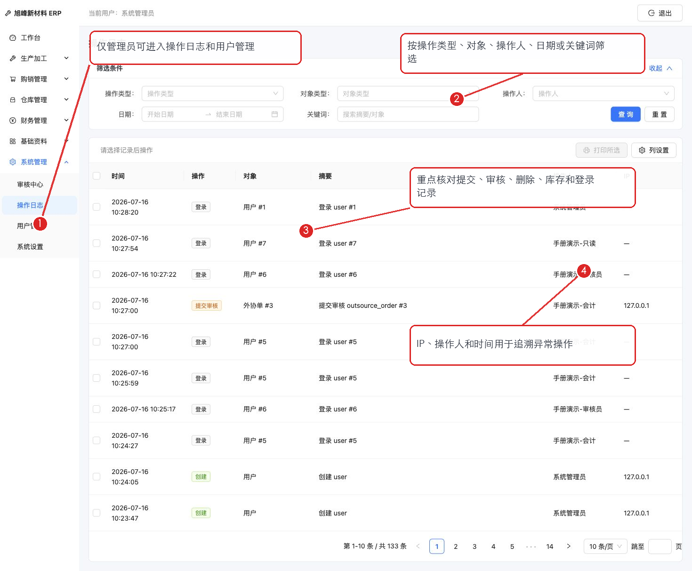

1. 按操作类型、对象类型、操作人、日期或关键词筛选。
2. 重点关注登录、创建、修改、删除、开始、提交审核、审核、反审核和库存变动。
3. 结合时间、操作人、对象和 IP 追溯异常。
4. 双击日志行查看变更前后或详细信息（如页面提供）。
5. 日志用于追溯，不应由普通业务人员修改。

### 6.4 审核、反审核与异常处理

管理员可执行审核员的通过/驳回操作，也可对已审核或已完成订单执行反审核。

反审核前必须确认：

- 是否已产生下游对账、收付款或开票；
- 是否已产生库存扣减/入库；
- 是否有其他订单引用该库存或批次；
- 是否取得业务负责人同意。

反审核会回滚相关库存联动。非必要不要使用；执行后立即让会计修正并重新走审核流程，同时在备注中记录原因。

### 6.5 系统设置现状

当前“系统设置”页面为占位页面，没有可供员工操作的正式设置项。不要把系统参数维护写入日常流程；如需新增配置，应由开发或系统负责人评估后实施。

## 7. 常见问题与处理

| 问题 | 处理方法 |
|---|---|
| 找不到“新建”按钮 | 核对当前用户角色。审核员和只读角色没有录入权限。 |
| 看不到审核中心 | 只有管理员和审核员可见。 |
| 订单无法编辑 | 检查是否已进入待审核、已审核或已完成状态。需要修改时按流程驳回或由管理员评估反审核。 |
| 开始冶炼/外协时提示库存不足 | 检查物品、规格、归属、单位和当前结存；不要直接用盘点调整掩盖差异。 |
| 销售提交、审核都成功，完成时却库存不足 | 销售在完成前不预占库存；查询所选库存行是否被其他业务先扣减，必要时驳回/撤销后重新选择库存。 |
| 外协货已经回厂，但库房中没有库存 | 检查订单是否仍为进行中、待审核或已审核；只有审核通过后执行“完成”才会把回厂明细入库。 |
| 冶炼已经投料，但库存只减少没有产出增加 | 投料在开始时出库，产出在完成时入库；先检查订单状态和产出明细，不能手工重复入库。 |
| 炼钢记录已确认，原料库存没有减少 | 这是当前设计：炼钢记录不联动库存。按公司规定另走冶炼或仓库领料流程，并防止重复扣料。 |
| 完成后出现另一条同名库存 | 对比规格、单位和归属。三者任一不同都可能形成独立库存行，不要用名称单独判断。 |
| 驳回后投料/发出库存没有恢复 | 驳回只退回修改，不回滚开始时库存；需要回草稿并回滚时使用“撤销”，且先核对实物。 |
| 反审核失败或提示库存不足 | 已入库的货可能已被下游使用，无法反向扣回；停止相关业务，由管理员查库存日志和下游订单。 |
| 删除单位或物品失败 | 该记录可能已被库存、订单、对账、付款或发票引用；改为停用或保留。 |
| 对账余额异常 | 检查订单是否重复导入、收付款方向、开票方向和关联订单。 |
| 表格没有显示所需字段 | 使用“列设置”，或横向滚动到表格右侧。 |
| 页面数据没有更新 | 先重置筛选并重新查询；仍异常时重新登录并联系管理员。 |
| 审核员发现资料不完整 | 使用“驳回”并写清缺失字段和正确处理要求。 |

## 8. 附录

### A. 岗位交接检查单

- [ ] 账号已按岗位分配正确角色；
- [ ] 已完成登录、退出和密码安全培训；
- [ ] 会计已掌握基础资料、订单、库存、对账、收付款和开票；
- [ ] 审核员已掌握详情核对、通过、驳回和批量审核；
- [ ] 只读人员确认不会借用他人账号录入；
- [ ] 管理员已掌握用户、日志和反审核风险；
- [ ] 培训数据与正式数据已明确区分。

### B. 截图与维护说明

- 原始截图：`images/raw/`
- 标注截图：`images/annotated/`
- 标注生成脚本：`annotate_screenshots.py`

界面改版后，应重新按角色登录、重复关键流程并更新截图；不要在旧截图上继续叠加说明。
